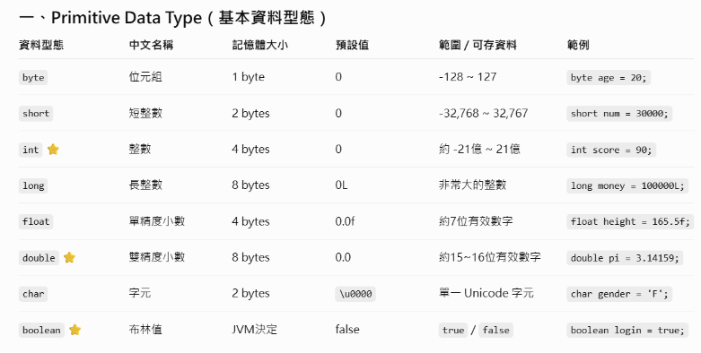
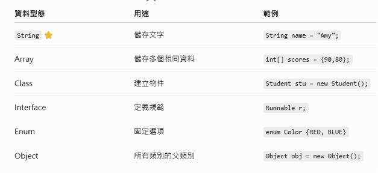

# Java

SDK：軟體開發套件（大統稱）
JDK：Java 開發套件

設定 JDK：
`Ctrl + Alt + Shift + S`

## 標記原始碼資料夾

對放程式碼的資料夾按右鍵：

> **Mark Directory as → Sources Root**

（資料夾圖示會變藍色）

---

# 快捷鍵

### (1) `psvm` + `Tab`

直接輸出：

```java
public static void main(String[] args) {}
```

### (2) `sout` + `Tab`

自動展開成：

```java
System.out.println();
```

---

# 變數與資料型態

## 變數

就是一個「盒子」，用來儲存資料，之後可以拿出來用或修改。

宣告變數的語法：

```java
資料型態 變數名稱 = 初始值;
```

## 資料型態

參考資料型態


### 小提醒

- `char` 一定要用單引號 `'A'`，不是雙引號。
- `long` 的數字後面要加 `L`，代表這是 `long` 型態。

---

# Scanner

可以讓你的程式讀取「使用者從鍵盤輸入」的資料。

---

# SQL Zoo

## 今日重點

- `CONCAT`：字串串接
- `DISTINCT`：去除重複資料
- `NOT IN`：排除子查詢回傳的所有值
- 子查詢（`SELECT ...`）會先執行，再把結果交給外層查詢使用
- `ALL`：比所有資料都 `[]`

---

## (1)

找出 **有頒發 Medicine**，但 **沒有頒發 Literature** 和 **Peace** 的年份。

```sql
SELECT DISTINCT yr
FROM nobel
WHERE subject = 'Medicine'
  AND yr NOT IN (
      SELECT yr
      FROM nobel
      WHERE subject = 'Literature'
  )
  AND yr NOT IN (
      SELECT yr
      FROM nobel
      WHERE subject = 'Peace'
  );
```

---

## (2)

找出歐洲國家名稱，還有每個國家人口與德國人口的比例。

`CONCAT + %` = 多串接一個 `%`

```sql
SELECT name,
       CONCAT(
           ROUND(
               100 * population / (
                   SELECT population
                   FROM world
                   WHERE name = 'Germany'
               )
           ),
           '%'
       )
FROM world
WHERE continent = 'Europe';
```

---

## (3)

找出每個洲最大 `area` 的國家。

```sql
SELECT continent, name, area
FROM world x
WHERE area >= ALL (
    SELECT area
    FROM world y
    WHERE y.continent = x.continent
      AND area > 0
);
```

`world x`：把 `world` 這個表存成 `x`。

---

# 相關子查詢（Correlated Subquery）

## 判斷方式

子查詢裡面有使用**外層查詢的欄位** → **相關子查詢**：不能獨立執行。

例如：

```sql
y.continent = x.continent
```

### 流程

```
外層取一筆資料 x
        ↓
子查詢根據 x 的資料查詢 y
        ↓
比較結果
        ↓
換下一筆 x 重複執行
```