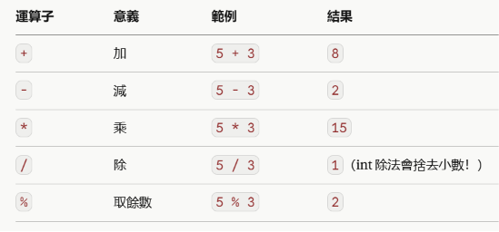
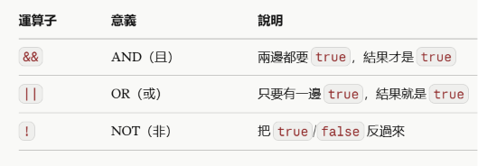

# Java — Day 2 筆記

## 算術運算子



> `int / int` 會直接捨去小數，若要保留小數需先用 `(double)` 強制轉型：
> `double result = (double) a / b;`

### 遞增遞減運算子

```java
int count = 5;
count++;  // count 變成 6，等同於 count = count + 1
count--;  // count 變回 5，等同於 count = count - 1
```

---

## 比較運算子

比較運算子用來比較兩個數值，結果永遠是 `boolean`。

| 運算子 | 意義 | 範例 | 結果 |
|---|---|---|---|
| `==` | 等於 | `5 == 5` | `true` |
| `!=` | 不等於 | `5 != 3` | `true` |
| `>` | 大於 | `5 > 3` | `true` |
| `<` | 小於 | `5 < 3` | `false` |
| `>=` | 大於等於 | `5 >= 5` | `true` |
| `<=` | 小於等於 | `5 <= 3` | `false` |

> **重點**：`=` 是賦值，`==` 是比較。

> **字串比較**：比較兩個字串內容是否相同，要用 `.equals()`，不能用 `==`（`==` 比較的是物件記憶體位置，不是文字內容）。
> ```java
> String a = "很好";
> String b = "很好";
> a.equals(b);  //  正確比較文字內容
> a == b;       //  不準確，不要用
> ```

---

## 邏輯運算子



> **短路求值**：`&&` 左邊為 `false` 就不再判斷右邊；`||` 左邊為 `true` 就不再判斷右邊。

---

## if / else

依照條件執行不同的程式區塊。

```java
if (條件) {
    // 條件為 true 時執行
} else if (另一個條件) {
    // 上面都不成立、這個成立時執行
} else {
    // 都不成立時執行
}
```

- Java 由上往下依序檢查，符合一個條件就執行對應區塊，並跳過剩下的 `else if / else`
- 可以巢狀（if 裡面再放 if）

> **陷阱**：if 底下若省略 `{}`，只有下一行程式碼受它控制，容易誤判邏輯，建議永遠加大括號。

---

## switch

針對「同一個變數」比對多個「固定值」時，比一長串 `else if` 更清楚。

**傳統寫法**（要記得加 `break`，否則會 fall-through 貫穿執行下一個 case）：
```java
switch (day) {
    case 1:
        System.out.println("星期一");
        break;
    default:
        System.out.println("其他天");
}
```

**新版箭頭寫法**（Java 14+，不需要 break，推薦優先使用）：
```java
switch (day) {
    case 1 -> System.out.println("星期一");
    case 2 -> System.out.println("星期二");
    default -> System.out.println("其他天");
}
```

> 判斷範圍或複雜邏輯（`>=`、`&&`）用 `if/else`；比對固定值用 `switch`。

---

## for 迴圈

重複執行一段程式碼，不用一行一行複製貼上。

```java
for (初始值; 條件; 每次執行後的動作) {
    // 重複執行的內容
}
```

```java
for (int i = 0; i < 5; i++) {
    System.out.println("i = " + i);
}
```

三部分：初始化（只跑一次）→ 條件（每輪檢查）→ 執行後動作（每輪跑完後執行，通常是 `i++`）。

**搭配 `%` 判斷奇偶數**：
```java
for (int i = 1; i <= 10; i++) {
    if (i % 2 == 0) {
        System.out.println(i); // 只印偶數
    }
}
```

---

## while 迴圈

跟 `for` 迴圈做的事情很像（重複執行），但寫法不一樣，適合用在**不知道確切要跑幾次**、只知道「條件成立就繼續跑」的情況。

```java
int i = 0;
while (i < 5) {
    System.out.println("i = " + i);
    i++; // 一定要記得寫，否則變成無窮迴圈
}
```

### do-while

跟 `while` 幾乎一樣，差別是**先執行一次，才檢查條件**（保證至少執行一次）：

---

## break / continue

| | 行為 |
|---|---|
| `break` | 整個迴圈**直接結束**，跳到迴圈外面 |
| `continue` | 只跳過**這一輪剩下的部分**，迴圈繼續跑下一輪 |


---

# SQL

## GROUP BY

用來將資料按照指定欄位進行**分組**：將相同類別的資料集合在一起，再對每一組進行統計。

常搭配聚合函數：

| 函數 | 用途 |
|---|---|
| `COUNT()` | 計算筆數 |
| `SUM()` | 加總 |
| `AVG()` | 平均值 |
| `MAX()` | 最大值 |
| `MIN()` | 最小值 |

### 基本語法

```sql
SELECT 欄位, 聚合函數(欄位)
FROM 表格
GROUP BY 欄位;
```

## HAVING

用來**篩選 GROUP BY 分組後產生的結果**。

- `WHERE`：篩選原始資料
- `HAVING`：篩選分組後資料

### WHERE 和 HAVING 差異

| | WHERE | HAVING |
|---|---|---|
| 執行時間 | GROUP BY 前 | GROUP BY 後 |
| 篩選對象 | 原始資料 | 分組結果 |
| 是否可以使用聚合函數 | ❌ 通常不行 | ✅ 可以 |

### 基本語法

```sql
SELECT 欄位, 聚合函數(欄位)
FROM 表格
GROUP BY 欄位
HAVING 條件;
```