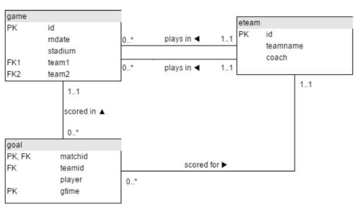

# Java — Day 4 筆記

## String 基本概念

`String` 是用來儲存**文字（一串字元）**的型態。宣告方式看起來像 primitive type，但 **`String` 其實不是 primitive type，是物件（Object）型態**：

---

### String 是「不可變的」（Immutable）

**String 一旦建立，內容就不能被改變。** 當你「修改」一個字串時，Java 其實是**建立了一個全新的字串**，不是真的去改動原本那個。

---
### 字串串接

```java
String firstName = "小";
String lastName = "明";
String fullName = firstName + lastName; // "小明"

int age = 20;
String message = "年齡: " + age; // int 自動轉成文字接上去
```

### 跳脫字元（Escape Characters）

| 跳脫字元 | 意義 |
|---|---|
| `\"` | 印出雙引號 |
| `\\` | 印出反斜線 |
| `\n` | 換行 |
| `\t` | Tab（縮排） |

```java
System.out.println("他說：\"你好！\""); // 他說："你好！"
System.out.println("第一行\n第二行");
```

---

## String 常用方法

| 方法 | 用途 | 
|---|---|
| `.length()` | 取得字串長度 |
| `.charAt(i)` | 取得指定位置字元（索引從0開始） | 
| `.substring(start)` | 從 start 擷取到最後 | 
| `.substring(start, end)` | 擷取 start 到 end（不含 end） | 
| `.toUpperCase()` | 轉大寫 | 
| `.toLowerCase()` | 轉小寫 | 
| `.trim()` | 去除頭尾空白 | 
| `.replace(old, new)` | 取代文字 | 
| `.split(分隔符)` | 切割成字串陣列 |
| `.contains(text)` | 是否包含某段文字 |

> `.length()` 是 method（有括號），跟陣列的 `.length`（沒括號）不一樣。

> ⚠️重要：這些 method 都不會修改原本的字串


### Method Chaining（連續呼叫）

因為每個 method 都回傳新字串，可以直接接著呼叫下一個：

```java
text.trim().toUpperCase();
```

---

## equals 比較

```java
String s1 = "Hello";
String s2 = "Hello";
System.out.println(s1 == s2); // true（原因跟你想的不一樣！）

String s3 = new String("Hello");
System.out.println(s1 == s3); // false！明明內容一樣，卻是 false
```
### 為什麼會這樣？（字串池 String Pool）

Java 為了節省記憶體，對於直接用雙引號寫的字串（像 `"Hello"`），會存在一個叫 **字串池（String Pool）** 的共用區域。如果兩個變數都寫一樣的文字，Java 會讓它們指向池子裡**同一個**物件，所以 `s1 == s2` 剛好是 `true`。

但 `new String("Hello")` 是**強制建立一個全新的物件**，不會共用字串池裡的物件，所以即使內容一樣，`==` 比較的是不同記憶體位置，結果是 `false`。

**結論**：`==` 拿來比較字串內容不可靠，結果會因為字串怎麼被建立而不同。

### 正確做法：一律用 `.equals()`
### 忽略大小寫比較：`.equalsIgnoreCase()`

```java
String s1 = "Hello";
String s2 = "HELLO";
System.out.println(s1.equals(s2));           // false，大小寫不同
System.out.println(s1.equalsIgnoreCase(s2)); // true，忽略大小寫
```
### Null 陷阱與防禦性寫法

```java
String input = null;
if (input.equals("exit")) { // ❌ input 是 null 時會拋出 NullPointerException
    // ...
}

if ("exit".equals(input)) { // ✅ 把已知不是 null 的字串放前面，就算 input 是 null 也不會出錯
    // ...
}
```
---

## StringBuilder

String 是不可變的，每次「修改」都建立新物件。若要做**大量、重複的字串拼接**（例如迴圈裡串接幾千次），會浪費效能。`StringBuilder` 是可以**直接在原地修改內容**的物件，效能好很多。

### 基本用法

- `.append(值)`：把內容接到後面，**直接修改自己**，不是建立新物件
- `.toString()`：轉回一般的 `String`（例如要 `.equals()` 比較時）

### 其他常用方法在程式碼

### String vs StringBuilder，什麼時候用哪個？

| | String | StringBuilder |
|---|---|---|
| 可變性 | 不可變，每次操作都建立新物件 | 可變，直接修改自己 |
| 效能（大量拼接時） | 差 | 好 |
| 使用時機 | 少量、簡單的字串操作 | 迴圈內大量拼接、動態組字串 |

> 原則：平常少量字串操作用 `String`；迴圈內反覆 `+=` 拼接時，改用 `StringBuilder`。

---

## Arrays 工具類

```java
import java.util.Arrays;
```

| 方法 | 用途 |
|---|---|
| `Arrays.toString(arr)` | 把陣列轉成好讀的字串格式印出 |
| `Arrays.sort(arr)` | 排序（**直接修改原陣列**） |
| `Arrays.equals(a, b)` | 比較兩個陣列內容是否相同（陣列也是物件，不能用 `==`） |
| `Arrays.fill(arr, 值)` | 把陣列全部填成同一個值 |
| `Arrays.copyOf(arr, 新長度)` | 複製陣列，可指定新長度（變長補0，變短則截斷） |

# SQL join 

## 看懂表


### 關聯名稱解析

* **`plays in`（參與比賽）**：連接 `eteam`（球隊）與 `game`（比賽）。

     *意思*：代表「球隊參與了這場比賽」。


* **`scored in`（發生於比賽）**：連接 `goal`（進球）與 `game`（比賽）。

     *意思*：代表「這顆進球是在哪一場比賽裡面踢進去的」。


* **`scored for`（為某隊進球）**：連接 `goal`（進球）與 `eteam`（球隊）。
    
     *意思*：代表「這顆進球是為哪一支球隊進的」。


---

###  欄位屬性說明

* **`PK`** (Primary Key，主鍵)
* **`FK`** (Foreign Key，外來鍵)
* **`PK, FK`** (主鍵兼外來鍵)

---

###  連線上的數字（如 `1..1`、`0..*`）代表資料之間的對應數量關係

#### 1. `game` 連結到 `eteam`（透過兩條 `plays in`）

這條線代表主隊（`team1`）與客隊（`team2`）怎麼跟球隊表對應：

* **靠近 `eteam` 那端的 `1..1`**：代表一場比賽裡填寫的「主隊代號」或「客隊代號」，絕對剛好對應到 `eteam` 裡的 1 支球隊。
* **靠近 `game` 那端的 `0..`**：代表一支球隊 (`eteam`)，可以在好幾場比賽的 `team1` 或 `team2` 欄位中出現（可以踢 0 場、1 場或很多場比賽）。

#### 2. `goal` 連結到 `game`（透過 `scored in`）

* **靠近 `game` 那端的 `1..1`**：每一個進球紀錄 (`goal`)，都必須剛好屬於 1 場特定的比賽（進球不可能憑空發生，一定在某場比賽內）。
* **靠近 `goal` 那端的 `0..`**：一場比賽 (`game`) 裡面，可以有 0 個進球（0:0 踢平）或是多個進球。

#### 3. `goal` 連結到 `eteam`（透過 `scored for`）

* **靠近 `eteam` 那端的 `1..1`**：每一個進球紀錄 (`goal`)，都必須是某 1 支特定的球隊踢進的。
* **靠近 `goal` 那端的 `0..`**：一支球隊 (`eteam`) 在整個賽事中，可以進 0 球或多顆球。

## 重點

#### 1.**欄位名稱模糊（Ambiguous Column Name）**：
* 當同時 `JOIN` 多個表且欄位名稱相同（例如多張表都有 `id`）時，資料庫會報錯。必須明確指定表格名稱，例如 `game.id` 或 `eteam.id`。

#### 2. 條件式計數：`CASE WHEN` 搭配 `SUM()`

* 當需要針對不同條件進行統計（例如分別計算主隊與客隊的進球數）時，可以使用 `CASE WHEN` 進行判斷：
```sql
SUM(CASE WHEN teamid = team1 THEN 1 ELSE 0 END) AS score1
```

* **原理**：符合條件回傳 `1`，不符合回傳 `0`，再透過外層的 `SUM()` 加總，就能精準算出特定隊伍的得分。

#### 3. 解決 0 分比賽消失的問題：`LEFT JOIN`

* 預設的 `INNER JOIN` 會把沒有進球紀錄（例如踢成 0:0）的比賽直接過濾掉。
* 必須改用 **`LEFT JOIN`** 以左邊的 `game` 表（所有賽事）為主，確保沒有進球的比賽也能完整保留，進球數會自動以 `0` 呈現。

#### 4. 分組與排序規則 (`GROUP BY` & `ORDER BY`)

* **原則**：出現在 `SELECT` 中、且沒有被包在聚合函數（如 `SUM`、`COUNT`）裡的普通欄位，**必須全部**放進 `GROUP BY` 裡面。
* 沒有要印在畫面上的欄位（例如 `matchid`），**也可以放進 `GROUP BY` 或 `ORDER BY**` 來協助資料分組與精準排序。